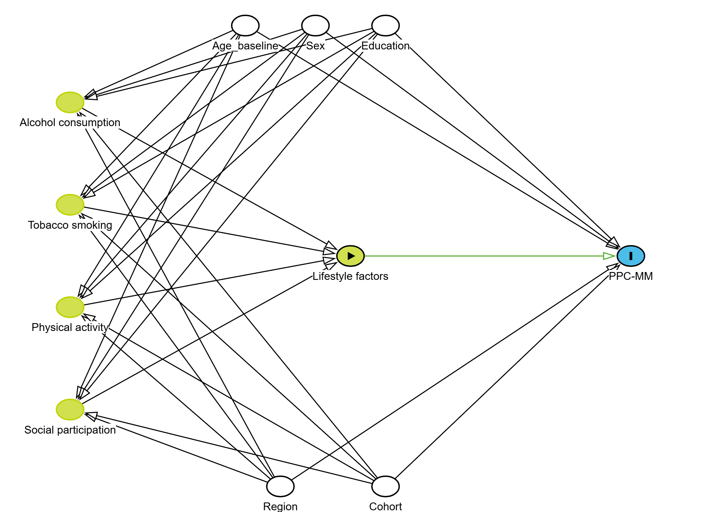
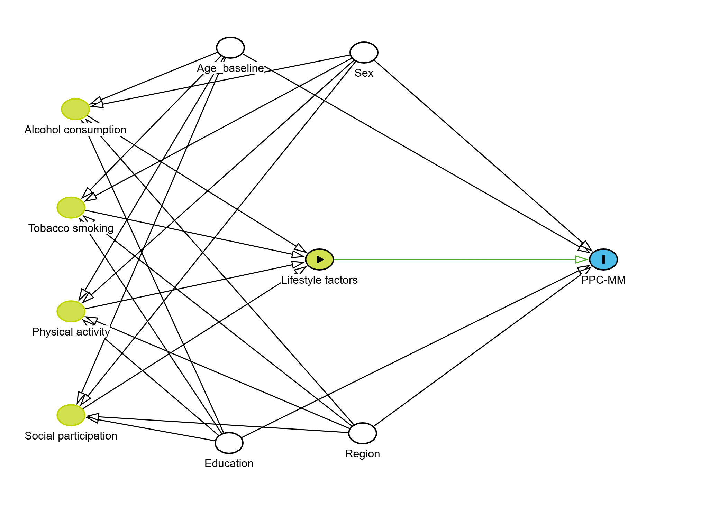

<div align="center">

# 🔬 Combined Lifestyle Factors and Physical-Psychological-Cognitive Multimorbidity in Older Adults

<br>

[](https://www.r-project.org/)
[]()
[]()
[]()
[]()

<br>

**📄 Full Title**

*Associations of Combined Lifestyle Factors with Physical-Psychological-Cognitive Multimorbidity in Older Adults: A Multi-Cohort Analysis of Five Prospective Studies*

<br>

A harmonized individual participant data analysis examining the dose-response relationship<br>
between modifiable lifestyle factors and multimorbidity across<br>
the physical, psychological, and cognitive health domains

<br>

</div>

---

## 📋 Table of Contents

<table align="center" width="100%">
<tr>
<td width="50%" valign="top">

**Study Design & Methods**

1. [Executive Summary](#1-executive-summary)
2. [Background & Rationale](#2-background--rationale)
3. [Study Objectives & Hypotheses](#3-study-objectives--hypotheses)
4. [Study Design](#4-study-design)
5. [Data Sources](#5-data-sources)
6. [Study Population](#6-study-population)

</td>
<td width="50%" valign="top">

**Variables & Analysis**

7. [Variable Definitions](#7-variable-definitions)
8. [Statistical Analysis Plan](#8-statistical-analysis-plan)
9. [Sensitivity Analyses](#9-sensitivity-analyses)
10. [Analysis Pipeline](#10-analysis-pipeline)
11. [Output Files](#11-output-files)
12. [Technical Documentation](#12-technical-documentation)

</td>
</tr>
</table>

---

## 1. Executive Summary

### 1.1 Study Synopsis

| Item                 | Description                                                                                   |
|:---------------------|:----------------------------------------------------------------------------------------------|
| **Design**           | Multi-cohort prospective study with harmonized individual participant data                   |
| **Population**       | Community-dwelling older adults aged ≥50 years                                               |
| **Setting**          | 20 countries across 5 international aging cohorts                                            |
| **Exposure**         | Cumulative unhealthy lifestyle score (0-4): drinking, smoking, physical inactivity, social isolation |
| **Primary Outcome**  | Incident Physical-Psychological-Cognitive Multimorbidity (PPC-MM)                            |
| **Sample Size**      | N = 31,302 participants free of PPC-MM at baseline                                           |
| **Follow-up**        | 5-7 years (2011-2020, varying by cohort)                                                     |
| **Analysis**         | Pooled Cox regression with cohort stratification + Random-effects meta-analysis              |

### 1.2 PICO Framework

| Component                  | Specification                                                                        |
|:---------------------------|:-------------------------------------------------------------------------------------|
| **P**opulation             | Adults ≥50 years, free of PPC-MM at baseline, from CHARLS, ELSA, HRS, MHAS, SHARE   |
| **I**ntervention/Exposure  | Unhealthy lifestyle factors (0, 1, 2, 3, or 4 factors)                              |
| **C**omparison             | 0 unhealthy lifestyle factors (reference group)                                      |
| **O**utcome                | Time to first PPC-MM event (≥2 of 3 health domains affected)                        |

### 1.3 Key Methodological Strengths

| Strength                              | Description                                              |
|:--------------------------------------|:---------------------------------------------------------|
| ✅ Large sample size                  | Adequate statistical power across subgroups              |
| ✅ Prospective design                 | Establishing temporal relationship                       |
| ✅ Harmonized data                    | Ensuring cross-cohort comparability                      |
| ✅ Geographic diversity               | Enhancing generalizability (20 countries)                |
| ✅ Comprehensive adjustment           | Demographic and regional confounders                     |
| ✅ Multiple sensitivity analyses      | Testing robustness of findings                           |
| ✅ Pre-specified analysis plan        | Minimizing selective reporting                           |

---

## 2. Background & Rationale

### 2.1 Burden of Multimorbidity in Older Adults

Multimorbidity—the coexistence of multiple chronic conditions—represents a major public health challenge in aging populations worldwide. While traditional multimorbidity research has focused primarily on physical conditions, emerging evidence highlights the importance of considering **cross-domain multimorbidity** that spans physical, psychological, and cognitive health domains.

### 2.2 The PPC-MM Concept

**Physical-Psychological-Cognitive Multimorbidity (PPC-MM)** is defined as the co-occurrence of conditions across at least two of three health domains:

<div align="center">

```
╔═══════════════════════════════════════════════════════════════════════════════╗
║                                                                               ║
║                            PPC-MM CONCEPTUAL MODEL                            ║
║                                                                               ║
║       ┌──────────────────┐                         ┌──────────────────┐       ║
║       │   PHYSICAL (P1)  │◄───────────────────────►│PSYCHOLOGICAL (P2)│       ║
║       │                  │                         │                  │       ║
║       │  • Hypertension  │       Bidirectional     │  • Depression    │       ║
║       │  • Diabetes      │       pathways via      │    (CES-D ≥4)    │       ║
║       │  • Heart disease │       inflammation,     │                  │       ║
║       │  • Stroke        │       HPA axis, etc.    │                  │       ║
║       │  • Cancer        │                         │                  │       ║
║       │  • Lung disease  │                         │                  │       ║
║       │  • Arthritis     │                         │                  │       ║
║       └────────┬─────────┘                         └────────┬─────────┘       ║
║                │                                            │                 ║
║                │             ┌──────────────────┐           │                 ║
║                │             │   COGNITIVE (C)  │           │                 ║
║                └────────────►│                  │◄──────────┘                 ║
║                              │  • Memory        │                             ║
║                              │  • Orientation   │                             ║
║                              │  • Executive     │                             ║
║                              │    function      │                             ║
║                              └──────────────────┘                             ║
║                                                                               ║
║                   PPC-MM = Any combination of ≥2 domains affected             ║
║                                                                               ║
╚═══════════════════════════════════════════════════════════════════════════════╝
```

</div>

### 2.3 Lifestyle Factors as Modifiable Risk Factors

| Factor                   | Biological Pathway                                           | Evidence Level    |
|:-------------------------|:-------------------------------------------------------------|:------------------|
| **Alcohol consumption**  | Neuroinflammation, oxidative stress, nutritional deficiency  | Strong            |
| **Tobacco smoking**      | Vascular damage, chronic inflammation, accelerated aging     | Strong            |
| **Physical inactivity**  | Reduced neuroplasticity, insulin resistance, muscle atrophy  | Strong            |
| **Social isolation**     | Chronic stress, reduced cognitive stimulation, depression    | Moderate-Strong   |

### 2.4 Knowledge Gap

While individual lifestyle factors have been associated with various health outcomes, **few studies have examined**:

1. The **cumulative effect** of multiple lifestyle factors on cross-domain multimorbidity
2. The **dose-response relationship** between lifestyle burden and PPC-MM risk
3. The **population-level impact** (Population Attributable Fraction, PAF) of unhealthy lifestyles on PPC-MM

---

## 3. Study Objectives & Hypotheses

### 3.1 Primary Objective

To investigate the association between cumulative unhealthy lifestyle factors and incident PPC-MM in older adults.

### 3.2 Secondary Objectives

| #    | Objective                                        | Analysis                                     |
|:-----|:-------------------------------------------------|:---------------------------------------------|
| 2a   | Examine the independent effect of each factor    | Mutually-adjusted Cox regression             |
| 2b   | Assess dose-response relationship                | P-trend test, 5-level categorical analysis   |
| 2c   | Evaluate PPC-MM subtype-specific associations    | Separate models for P1P2, P1C, P2C, P1P2C    |
| 2d   | Estimate population-level impact                 | Population Attributable Fraction (PAF)       |
| 2e   | Assess heterogeneity across cohorts              | Random-effects meta-analysis                 |
| 2f   | Age and sex stratification                       | Subgroup analysis with interaction tests     |

### 3.3 A Priori Hypotheses

> **H1**: There is a positive dose-response relationship between the number of unhealthy lifestyle factors and PPC-MM risk (P-trend < 0.05)

> **H2**: Each unhealthy lifestyle factor is independently associated with increased PPC-MM risk after mutual adjustment (HR > 1.0)

> **H3**: The cumulative lifestyle effect is consistent across geographic regions and cohorts (I² < 50%)

---

## 4. Study Design

### 4.1 Design Overview

<div align="center">

```
╔═══════════════════════════════════════════════════════════════════════════════╗
║                             STUDY DESIGN FLOWCHART                            ║
╠═══════════════════════════════════════════════════════════════════════════════╣
║                                                                               ║
║   ┌───────────────────────────────────────────────────────────────────────┐   ║
║   │                       5 INTERNATIONAL COHORTS                         │   ║
║   │    CHARLS (China) │ ELSA (UK) │ HRS (USA) │ MHAS (Mexico) │ SHARE     │   ║
║   └───────────────────────────────────────────────────────────────────────┘   ║
║                                      │                                        ║
║                                      ▼                                        ║
║   ┌───────────────────────────────────────────────────────────────────────┐   ║
║   │                        DATA HARMONIZATION                             │   ║
║   │              Gateway to Global Aging Data (g2aging.org)               │   ║
║   └───────────────────────────────────────────────────────────────────────┘   ║
║                                      │                                        ║
║                                      ▼                                        ║
║   ┌───────────────────────────────────────────────────────────────────────┐   ║
║   │                   INCLUSION/EXCLUSION CRITERIA                        │   ║
║   │      • Age ≥50 years                                                  │   ║
║   │      • Free of PPC-MM at baseline (<2 domains affected)               │   ║
║   │      • Complete exposure data                                         │   ║
║   │      • ≥1 follow-up assessment                                        │   ║
║   │      • No severe neurological conditions                              │   ║
║   └───────────────────────────────────────────────────────────────────────┘   ║
║                                      │                                        ║
║                                      ▼                                        ║
║   ┌─────────────────────┐  ┌─────────────────────┐  ┌─────────────────────┐   ║
║   │   POOLED ANALYSIS   │  │    META-ANALYSIS    │  │     SENSITIVITY     │   ║
║   │   Cox regression    │  │   Random-effects    │  │   ANALYSES (S1-S4)  │   ║
║   │  + strata(cohort)   │  │  + heterogeneity    │  │                     │   ║
║   └─────────────────────┘  └─────────────────────┘  └─────────────────────┘   ║
║                                                                               ║
╚═══════════════════════════════════════════════════════════════════════════════╝
```

</div>

### 4.2 Design Strengths & Limitations

| Aspect             | Strength                  | Potential Limitation             | Mitigation Strategy         |
|:-------------------|:--------------------------|:---------------------------------|:----------------------------|
| **Temporality**    | Prospective design        | Exposure at single timepoint     | Sensitivity analysis (S4)   |
| **Sample size**    | N > 31,000                | Unbalanced cohort sizes          | Cohort stratification       |
| **Generalizability** | 20 countries            | Selection into cohorts           | Region adjustment           |
| **Exposure**       | Standardized definitions  | Self-report                      | Harmonized instruments      |
| **Outcome**        | Clinical criteria         | Variable assessment schedules    | Time-to-event analysis      |
| **Confounding**    | Multiple adjustments      | Unmeasured confounders           | DAG-informed selection      |

---

## 5. Data Sources

### 5.1 Participating Cohorts

<table align="center" width="100%">
<thead>
<tr>
<th align="left">Cohort</th>
<th align="left">Full Name</th>
<th align="center">Country/Region</th>
<th align="center">Baseline Wave</th>
<th align="center">Study Period</th>
<th align="right">N (Main)</th>
<th align="left">Geographic Region</th>
</tr>
</thead>
<tbody>
<tr>
<td align="left"><b>HRS</b></td>
<td align="left">Health and Retirement Study</td>
<td align="center">🇺🇸 USA</td>
<td align="center">Wave 12 (2014)</td>
<td align="center">2014-2019</td>
<td align="right">2,786</td>
<td align="left">Northern America</td>
</tr>
<tr>
<td align="left"><b>ELSA</b></td>
<td align="left">English Longitudinal Study of Ageing</td>
<td align="center">🇬🇧 England</td>
<td align="center">Wave 7 (2014)</td>
<td align="center">2014-2019</td>
<td align="right">4,385</td>
<td align="left">Northern Europe</td>
</tr>
<tr>
<td align="left"><b>SHARE</b></td>
<td align="left">Survey of Health, Ageing and Retirement in Europe</td>
<td align="center">🇪🇺 16 Countries</td>
<td align="center">Wave 6 (2015)</td>
<td align="center">2015-2020</td>
<td align="right">13,488</td>
<td align="left">Multiple (Europe)</td>
</tr>
<tr>
<td align="left"><b>MHAS</b></td>
<td align="left">Mexican Health and Aging Study</td>
<td align="center">🇲🇽 Mexico</td>
<td align="center">Wave 3 (2012)</td>
<td align="center">2012-2019</td>
<td align="right">7,870</td>
<td align="left">Central America</td>
</tr>
<tr>
<td align="left"><b>CHARLS</b></td>
<td align="left">China Health and Retirement Longitudinal Study</td>
<td align="center">🇨🇳 China</td>
<td align="center">Wave 1 (2011)</td>
<td align="center">2011-2018</td>
<td align="right">2,322</td>
<td align="left">Eastern Asia</td>
</tr>
<tr>
<td align="left" colspan="5"><b>TOTAL</b></td>
<td align="right"><b>31,302</b></td>
<td align="left"><b>20 Countries</b></td>
</tr>
</tbody>
</table>

### 5.2 SHARE European Countries

| Region               | Countries                                              | N        |
|:---------------------|:-------------------------------------------------------|---------:|
| **Western Europe**   | Austria, Switzerland, France, Belgium, Netherlands, Germany | 5,620 |
| **Northern Europe**  | Estonia, Sweden, Denmark                               | 2,850    |
| **Southern Europe**  | Spain, Italy, Portugal, Slovenia                       | 2,910    |
| **Eastern Europe**   | Czech Republic, Poland, Hungary                        | 2,108    |

### 5.3 Follow-up Structure

<div align="center">

```
Timeline: Baseline ───────────────────────────────────────────► End of Follow-up

HRS:      Wave 12 (2014) → Wave 13 → Wave 14                            [5 years]
ELSA:     Wave 7 (2014) → Wave 8 → Wave 9                               [5 years]
SHARE:    Wave 6 (2015) → Wave 7 → Wave 8                               [5 years]
MHAS:     Wave 3 (2012) → Wave 4 → Wave 5                               [7 years]
CHARLS:   Wave 1 (2011) → Wave 2 → Wave 3 → Wave 4                      [7 years]
```

</div>

---

## 6. Study Population

### 6.1 Eligibility Criteria

**Inclusion Criteria**

| Criterion                            | Rationale                                     |
|:-------------------------------------|:----------------------------------------------|
| Age ≥50 years at baseline            | Target population for aging research          |
| Free of PPC-MM at baseline           | Incident case analysis requirement            |
| Complete lifestyle exposure data     | Valid exposure classification                 |
| ≥1 follow-up assessment              | Time-to-event analysis requirement            |

**Exclusion Criteria**

| Criterion                            | Rationale                                     |
|:-------------------------------------|:----------------------------------------------|
| Prevalent PPC-MM at baseline         | Avoid prevalent-incident case mixing          |
| Severe neurological conditions       | Potential for reverse causation               |
| Missing key covariates               | Valid adjustment requirement                  |

### 6.2 Participant Flow

<div align="center">

```
╔═══════════════════════════════════════════════════════════════════════════════╗
║                           PARTICIPANT FLOW DIAGRAM                            ║
╠═══════════════════════════════════════════════════════════════════════════════╣
║                                                                               ║
║       Total participants in 5 cohorts at baseline wave                        ║
║                                                            N = ~80,000        ║
║                                    │                                          ║
║                                    ▼                                          ║
║       ┌───────────────────────────────────────────────────────────────┐       ║
║       │  EXCLUSION STEP 1: Age < 50 years                             │       ║
║       └───────────────────────────────────────────────────────────────┘       ║
║                                    │                                          ║
║                                    ▼                                          ║
║       ┌───────────────────────────────────────────────────────────────┐       ║
║       │  EXCLUSION STEP 2: Prevalent PPC-MM at baseline               │       ║
║       │  (≥2 of 3 domains already affected)                           │       ║
║       └───────────────────────────────────────────────────────────────┘       ║
║                                    │                                          ║
║                                    ▼                                          ║
║       ┌───────────────────────────────────────────────────────────────┐       ║
║       │  EXCLUSION STEP 3: Missing lifestyle exposure data            │       ║
║       └───────────────────────────────────────────────────────────────┘       ║
║                                    │                                          ║
║                                    ▼                                          ║
║       ┌───────────────────────────────────────────────────────────────┐       ║
║       │  EXCLUSION STEP 4: Severe neurological conditions             │       ║
║       └───────────────────────────────────────────────────────────────┘       ║
║                                    │                                          ║
║                                    ▼                                          ║
║       ┌───────────────────────────────────────────────────────────────┐       ║
║       │  EXCLUSION STEP 5: No follow-up data available                │       ║
║       └───────────────────────────────────────────────────────────────┘       ║
║                                    │                                          ║
║                                    ▼                                          ║
║       ╔═══════════════════════════════════════════════════════════════╗       ║
║       ║          FINAL ANALYTIC SAMPLE: N = 31,302                    ║       ║
║       ╚═══════════════════════════════════════════════════════════════╝       ║
║                                                                               ║
╚═══════════════════════════════════════════════════════════════════════════════╝
```

</div>

---

## 7. Variable Definitions

### 7.1 Primary Outcome: PPC-MM

**Definition**: Incident Physical-Psychological-Cognitive Multimorbidity, defined as the **first occurrence of having ≥2 of 3 health domains affected** during follow-up.

**Domain Definitions**

<table align="center" width="100%">
<thead>
<tr>
<th align="left" width="15%">Domain</th>
<th align="left" width="25%">Component</th>
<th align="left" width="35%">Measurement</th>
<th align="left" width="25%">Threshold</th>
</tr>
</thead>
<tbody>
<tr>
<td align="left" rowspan="7"><b>Physical (P1)</b></td>
<td align="left" colspan="3"><i>Chronic disease count ≥2 of the following:</i></td>
</tr>
<tr>
<td align="left">Hypertension</td>
<td align="left">Self-reported physician diagnosis</td>
<td align="left">Yes/No</td>
</tr>
<tr>
<td align="left">Diabetes</td>
<td align="left">Self-reported physician diagnosis</td>
<td align="left">Yes/No</td>
</tr>
<tr>
<td align="left">Cancer</td>
<td align="left">Self-reported physician diagnosis</td>
<td align="left">Yes/No</td>
</tr>
<tr>
<td align="left">Lung disease</td>
<td align="left">Self-reported physician diagnosis</td>
<td align="left">Yes/No</td>
</tr>
<tr>
<td align="left">Heart disease</td>
<td align="left">Self-reported physician diagnosis</td>
<td align="left">Yes/No</td>
</tr>
<tr>
<td align="left">Stroke</td>
<td align="left">Self-reported physician diagnosis</td>
<td align="left">Yes/No</td>
</tr>
<tr>
<td align="left"><b>Psychological (P2)</b></td>
<td align="left">Depression</td>
<td align="left">CES-D 10-item scale (0-30)</td>
<td align="left"><b>Score ≥4</b></td>
</tr>
<tr>
<td align="left" rowspan="4"><b>Cognitive (C)</b></td>
<td align="left" colspan="3"><i>Age-standardized composite z-score &lt;-1.5 SD:</i></td>
</tr>
<tr>
<td align="left">Memory</td>
<td align="left">Immediate and delayed word recall</td>
<td align="left">Combined score</td>
</tr>
<tr>
<td align="left">Orientation</td>
<td align="left">Date, day, month, year</td>
<td align="left">0-4 scale</td>
</tr>
<tr>
<td align="left">Executive function</td>
<td align="left">Serial 7s subtraction</td>
<td align="left">0-5 scale</td>
</tr>
</tbody>
</table>

### 7.2 Secondary Outcomes: PPC-MM Subtypes

| Outcome Code | Full Name                 | Definition                 | Event Variable           | Time Variable             |
|:-------------|:--------------------------|:---------------------------|:-------------------------|:--------------------------|
| **Overall**  | Overall PPC-MM            | ≥2 of 3 domains affected   | `event_ppcmm`            | `time_ppcmm_months`       |
| **P1P2**     | Physical-Psychological    | Physical + Psychological   | `event_mm_phys_psych`    | `time_mm_phys_psych`      |
| **P1C**      | Physical-Cognitive        | Physical + Cognitive       | `event_mm_phys_cog`      | `time_mm_phys_cog`        |
| **P2C**      | Psychological-Cognitive   | Psychological + Cognitive  | `event_mm_psych_cog`     | `time_mm_psych_cog`       |
| **P1P2C**    | Triple Multimorbidity     | All three domains          | `event_mm_all_three`     | `time_mm_all_three`       |

### 7.3 Primary Exposure: Lifestyle Factors

**Individual Lifestyle Factors**

| Factor                 | Variable          | Operational Definition                          | Coding                    |
|:-----------------------|:------------------|:------------------------------------------------|:--------------------------|
| **Alcohol**            | `unhealthy_drink` | Any current alcohol consumption                 | 0=No/Former, 1=Current    |
| **Tobacco**            | `unhealthy_smoke` | Current tobacco smoking                         | 0=Never/Former, 1=Current |
| **Physical Activity**  | `unhealthy_pa`    | No moderate or vigorous activity weekly         | 0=Active, 1=Inactive      |
| **Social Isolation**   | `unhealthy_soc`   | Living alone AND no social participation        | 0=Connected, 1=Isolated   |

**Cumulative Lifestyle Score**

| Variable            | Formula                   | Range | Categories                |
|:--------------------|:--------------------------|:------|:--------------------------|
| `unhealthy_score`   | Sum of 4 binary factors   | 0-4   | Continuous                |
| `n_lifestyle_cat`   | Categorical grouping      | —     | 0 (ref), 1, 2, 3+         |
| `n_lifestyle_5cat`  | Finer categories (S1)     | —     | 0 (ref), 1, 2, 3, 4       |

### 7.4 Covariates (Adjustment Variables)

**Covariate Selection Rationale (DAG-Informed)**

<div align="center">
  
  
</div>

**Covariate Specifications**

| Variable         | Type        | Categories/Units                          | Role           | Adjustment Rationale                          |
|:-----------------|:------------|:------------------------------------------|:---------------|:----------------------------------------------|
| `age_baseline`   | Continuous  | Years                                     | Confounder     | Strong predictor of both exposure and outcome |
| `sex`            | Binary      | Men (ref), Women                          | Confounder     | Sex differences in lifestyle and health       |
| `edu`            | 3-level     | Primary (ref), Secondary, Tertiary        | Confounder     | SES proxy; affects lifestyle and healthcare   |
| `region`         | 7-level     | See Section 5.2                           | Confounder     | Cultural/environmental factors                |
| `cohort`         | 5-level     | CHARLS, ELSA, HRS, MHAS, SHARE            | Stratification | Controls baseline hazard differences          |

**Final Model Specification**

```r
# Cox Proportional Hazards Model
coxph(
  Surv(time_ppcmm_months, event_ppcmm) ~ 
    n_lifestyle_cat +      # Exposure (categorical)
    age_baseline +         # Continuous
    sex +                  # Binary
    edu +                  # 3-level factor
    region +               # 7-level factor
    strata(cohort),        # Stratification (separate baseline hazards)
  data = pooled_data
)
```

---

## 8. Statistical Analysis Plan

### 8.1 Analysis Overview

| Analysis Type   | Method                    | Software            | Purpose                    |
|:----------------|:--------------------------|:--------------------|:---------------------------|
| Descriptive     | TableOne, frequencies     | R (tableone)        | Baseline characteristics   |
| Correlation     | Phi coefficient, ICC      | R (psych, lme4)     | Lifestyle factor correlations |
| Primary         | Cox regression (pooled)   | R (survival)        | Main effect estimates      |
| Subgroup        | Age/Sex stratification    | R (survival)        | Effect modification        |
| Secondary       | Meta-analysis             | R (meta, metafor)   | Heterogeneity assessment   |
| Exploratory     | PAF analysis              | R (custom)          | Population impact          |

### 8.2 Descriptive Analysis

**Baseline characteristics** stratified by:
- Cohort (5 groups)
- Lifestyle score category (0, 1, 2, 3+)

**Statistics reported**:
- Continuous variables: Mean ± SD or Median (IQR)
- Categorical variables: N (%)
- Standardized mean differences for imbalance assessment

### 8.3 Correlation Analysis

**Phi Coefficient (Between Lifestyle Factors)**

| Parameter       | Specification                                        |
|:----------------|:-----------------------------------------------------|
| **Method**      | Pearson correlation for binary variables             |
| **95% CI**      | Bootstrap (B = 1,000, parallel computing)            |
| **P-value**     | Chi-square test of independence                      |
| **Correction**  | Bonferroni (6 pairwise comparisons, α = 0.0083)      |

**Interpretation Scale**:

| Phi Value       | Interpretation |
|:----------------|:---------------|
| \|Φ\| < 0.10    | Negligible     |
| \|Φ\| 0.10-0.20 | Weak           |
| \|Φ\| 0.20-0.30 | Moderate       |
| \|Φ\| > 0.30    | Strong         |

**Intraclass Correlation Coefficient (ICC)**

| Parameter         | Specification                              |
|:------------------|:-------------------------------------------|
| **Model**         | Mixed-effects logistic regression          |
| **Random effect** | Cohort (5 clusters)                        |
| **95% CI**        | Delta method approximation                 |
| **P-value**       | Likelihood Ratio Test (LRT)                |
| **R Package**     | lme4 + performance                         |

### 8.4 Cox Proportional Hazards Regression

**Model Assumptions**

| Assumption                | Verification Method              | Action if Violated           |
|:--------------------------|:---------------------------------|:-----------------------------|
| Proportional hazards      | Schoenfeld residuals, log-log plot | Time-varying coefficients  |
| Linearity (continuous)    | Martingale residuals             | Spline transformation        |
| No influential observations | dfbeta statistics              | Sensitivity exclusion        |
| No multicollinearity      | VIF < 5                          | Variable selection           |

**Effect Measures**

| Measure       | Definition              | Interpretation                    |
|:--------------|:------------------------|:----------------------------------|
| **HR**        | Hazard Ratio = exp(β)   | Relative hazard of PPC-MM         |
| **95% CI**    | Confidence Interval     | Precision of estimate             |
| **P-value**   | Two-sided               | Statistical significance (α=0.05) |
| **P-trend**   | Ordinal exposure test   | Dose-response evidence            |

### 8.5 Subgroup Analysis

**Age Stratification**

| Age Group | N (Approx) | Purpose                                |
|:----------|:-----------|:---------------------------------------|
| 50-59     | 11,126     | Young-old adults                       |
| 60-69     | 11,276     | Middle-old adults                      |
| 70-79     | 7,330      | Old-old adults                         |
| 80+       | 2,249      | Oldest-old adults                      |

**Sex Stratification**

| Sex    | N (Approx) | Purpose                                |
|:-------|:-----------|:---------------------------------------|
| Men    | 15,263     | Male-specific effects                  |
| Women  | 16,718     | Female-specific effects                |

**Interaction Tests**: P for interaction calculated for age×lifestyle and sex×lifestyle

### 8.6 Meta-Analysis

| Parameter                   | Method/Value                              |
|:----------------------------|:------------------------------------------|
| **Effect measure**          | Hazard Ratio (log scale)                  |
| **Fixed-effects model**     | Inverse variance weighting                |
| **Random-effects model**    | DerSimonian-Laird estimator               |
| **Heterogeneity statistics**| Q statistic, I², τ²                       |
| **Model selection**         | Random-effects if I² > 50%                |
| **Sensitivity analysis**    | Leave-one-out (jackknife)                 |
| **Publication bias**        | Egger's regression, Begg's rank test, Funnel plots |

### 8.7 Population Attributable Fraction (PAF)

**Miettinen Formula** (appropriate for cohort studies):

$$PAF = P_{case} \times \frac{HR - 1}{HR}$$

Where:
- $P_{case}$ = Proportion of cases exposed
- $HR$ = Adjusted hazard ratio

**Confidence Intervals**: Bootstrap (B = 1,000)

---

## 9. Sensitivity Analyses

### 9.1 Pre-Specified Sensitivity Analyses

| Code    | Analysis                        | Rationale                         | Expected Impact              | Output Files                              |
|:--------|:--------------------------------|:----------------------------------|:-----------------------------|:------------------------------------------|
| **S1**  | 5-level exposure (0/1/2/3/4)    | Finer dose-response assessment    | More precise gradient        | `Cox_S1_5Level_Categories.csv`            |
| **S2**  | Heavy drinking definition       | Alternative exposure coding       | More conservative estimate   | `Cox_S2a_HeavyDrink_Individual.csv`, `Cox_S2b_HeavyDrink_Cumulative.csv` |
| **S3**  | MICE imputed data               | Missing data sensitivity          | Similar if MAR holds         | `Cox_S3_MICE_Individual.csv`, `Cox_S3_MICE_Cumulative.csv` |
| **S4**  | Exclude first follow-up wave    | Reverse causality concern         | Attenuated if reverse causal | `Cox_S4_Drop1st.csv`                      |

> **Note**: All sensitivity analyses use **pooled Cox regression with `strata(cohort)`** to produce population-level hazard ratios, consistent with the primary analysis. Meta-analysis results for sensitivity analyses are also available in `Meta_Analysis_Comprehensive.xlsx`.

### 9.2 S1: 5-Level Lifestyle Categories

**Rationale**: The primary analysis combines 3 and 4 unhealthy factors (3+). S1 examines whether the effect saturates at 3 factors or continues to increase.

<div align="center">

```
Primary:    0 (ref) ──► 1 ──► 2 ──► 3+

S1:         0 (ref) ──► 1 ──► 2 ──► 3 ──► 4
```

</div>

### 9.3 S2: Heavy Drinking Definition

**Rationale**: The primary definition includes any alcohol consumption. S2 uses a stricter threshold aligned with clinical guidelines.

| Definition                  | Men              | Women            |
|:----------------------------|:-----------------|:-----------------|
| Primary (any drinking)      | >0 drinks/week   | >0 drinks/week   |
| S2 (heavy drinking)         | >14 drinks/week  | >7 drinks/week   |

### 9.4 S3: Multiple Imputation

**Rationale**: Address potential selection bias from complete-case analysis.

| Parameter            | Value                               |
|:---------------------|:------------------------------------|
| **Method**           | 2-Level MICE (multilevel)           |
| **Level 2 cluster**  | Cohort (5 clusters)                 |
| **Imputations**      | m = 20                              |
| **Iterations**       | maxit = 30                          |
| **Pooling**          | Rubin's rules                       |

### 9.5 S4: Exclude First Follow-up Wave

**Rationale**: Subclinical disease at baseline may influence both lifestyle and subsequent PPC-MM (reverse causality).

<div align="center">

```
Primary:    Baseline ─────────────────────────────────► All follow-up waves
S4:         Baseline ────── [Exclude Wave 2] ─────► Wave 3 onwards
```

</div>

---

## 10. Analysis Pipeline

### 10.1 Script Architecture

<div align="center">

```
╔═══════════════════════════════════════════════════════════════════════════════╗
║                              ANALYSIS PIPELINE                                ║
╠═══════════════════════════════════════════════════════════════════════════════╣
║                                                                               ║
║   ┌───────────────────────────────────────────────────────────────────────┐   ║
║   │  00_Functions_and_Setup.R                                             │   ║
║   │  ├── Environment configuration                                        │   ║
║   │  ├── Path definitions                                                 │   ║
║   │  ├── Covariate specifications (COX_COVARIATES)                        │   ║
║   │  ├── MICE configuration (MICE_CONFIG)                                 │   ║
║   │  └── Helper functions                                                 │   ║
║   └───────────────────────────────────────────────────────────────────────┘   ║
║                                      │                                        ║
║                                      ▼                                        ║
║   ┌───────────────────────────────────────────────────────────────────────┐   ║
║   │  01_Pooled_Descriptive.R                                              │   ║
║   │  ├── Load and harmonize cohort data                                   │   ║
║   │  ├── Apply inclusion/exclusion criteria                               │   ║
║   │  ├── Generate TableOne                                                │   ║
║   │  └── Output: Descriptive_Statistics.xlsx                              │   ║
║   └───────────────────────────────────────────────────────────────────────┘   ║
║                                      │                                        ║
║                                      ▼                                        ║
║   ┌───────────────────────────────────────────────────────────────────────┐   ║
║   │  02_MICE_Imputation.R [Optional]                                      │   ║
║   │  ├── Missing data assessment                                          │   ║
║   │  ├── 2-Level MICE (cohort clusters)                                   │   ║
║   │  └── Output: Pooled_mice_imputed.rds                                  │   ║
║   └───────────────────────────────────────────────────────────────────────┘   ║
║                                      │                                        ║
║                                      ▼                                        ║
║   ┌───────────────────────────────────────────────────────────────────────┐   ║
║   │  03_Phi_ICC_Analysis.R                                                │   ║
║   │  ├── Phi coefficients (parallel bootstrap)                            │   ║
║   │  ├── ICC for clustering                                               │   ║
║   │  ├── Bonferroni correction                                            │   ║
║   │  └── Output: Phi_ICC_Analysis_Results.xlsx                            │   ║
║   └───────────────────────────────────────────────────────────────────────┘   ║
║                                      │                                        ║
║                                      ▼                                        ║
║   ┌───────────────────────────────────────────────────────────────────────┐   ║
║   │  04_Pooled_Cox_Analysis.R                                             │   ║
║   │  ├── Primary: Individual factors (mutually adjusted)                  │   ║
║   │  ├── Primary: Cumulative effect (4-level)                             │   ║
║   │  ├── Sensitivity: S1, S2, S3, S4                                      │   ║
║   │  └── Output: Pooled_Cox_Results_Comprehensive.xlsx                    │   ║
║   └───────────────────────────────────────────────────────────────────────┘   ║
║                                      │                                        ║
║                                      ▼                                        ║
║   ┌───────────────────────────────────────────────────────────────────────┐   ║
║   │  05_Subgroup_Analysis.R                                               │   ║
║   │  ├── Age-stratified Cox (50-59, 60-69, 70-79, 80+)                    │   ║
║   │  ├── Sex-stratified Cox (Men, Women)                                  │   ║
║   │  ├── Age×Lifestyle and Sex×Lifestyle interaction tests               │   ║
║   │  ├── Age-stratified PAF (Individual and Cumulative)                   │   ║
║   │  ├── Sex-stratified PAF (Individual and Cumulative)                   │   ║
║   │  └── Output: Subgroup_Analysis_Complete.xlsx                          │   ║
║   └───────────────────────────────────────────────────────────────────────┘   ║
║                                      │                                        ║
║                                      ▼                                        ║
║   ┌───────────────────────────────────────────────────────────────────────┐   ║
║   │  06_Sankey_Diagram.R                                                  │   ║
║   │  ├── Health state transitions (baseline → follow-up)                  │   ║
║   │  ├── Stratified by lifestyle category                                 │   ║
║   │  └── Output: Sankey_*.pdf/png                                         │   ║
║   └───────────────────────────────────────────────────────────────────────┘   ║
║                                      │                                        ║
║                                      ▼                                        ║
║   ┌───────────────────────────────────────────────────────────────────────┐   ║
║   │  07_PAF_Analysis.R                                                    │   ║
║   │  ├── Individual factor PAFs                                           │   ║
║   │  ├── Cumulative PAF                                                   │   ║
║   │  └── Output: PAF_Analysis_Comprehensive.xlsx                          │   ║
║   └───────────────────────────────────────────────────────────────────────┘   ║
║                                      │                                        ║
║                                      ▼                                        ║
║   ┌───────────────────────────────────────────────────────────────────────┐   ║
║   │  08_Meta_Analysis.R                                                   │   ║
║   │  ├── Cohort-specific Cox models                                       │   ║
║   │  ├── Random-effects meta-analysis                                     │   ║
║   │  ├── Heterogeneity assessment                                         │   ║
║   │  ├── Publication bias tests                                           │   ║
║   │  └── Output: Meta_Analysis_Comprehensive.xlsx, Forest/Funnel plots    │   ║
║   └───────────────────────────────────────────────────────────────────────┘   ║
║                                      │                                        ║
║                                      ▼                                        ║
║   ┌───────────────────────────────────────────────────────────────────────┐   ║
║   │  09_Methods_Parameters.R                                              │   ║
║   │  ├── Export all statistical parameters                                │   ║
║   │  └── Output: Methods_Parameters.xlsx (11 sheets)                      │   ║
║   └───────────────────────────────────────────────────────────────────────┘   ║
║                                                                               ║
╚═══════════════════════════════════════════════════════════════════════════════╝
```

</div>

### 10.2 Script Details

| Script                        | Purpose                                          | Key Methods                       | Primary Output                           |
|:------------------------------|:-------------------------------------------------|:----------------------------------|:-----------------------------------------|
| `00_Functions_and_Setup.R`    | Environment setup, paths, configuration          | Package loading, global constants | —                                        |
| `01_Pooled_Descriptive.R`     | Data pooling and baseline characteristics        | TableOne, SMD                     | `Descriptive_Statistics.xlsx`            |
| `02_MICE_Imputation.R`        | 2-Level multiple imputation                      | mice, miceadds (2l.pmm)           | `Pooled_mice_imputed.rds`                |
| `03_Phi_ICC_Analysis.R`       | Correlation and clustering                       | Bootstrap, LRT, Bonferroni        | `Phi_ICC_Analysis_Results.xlsx`          |
| `04_Pooled_Cox_Analysis.R`    | Cox proportional hazards                         | coxph, strata(), P-trend          | `Pooled_Cox_Results_Comprehensive.xlsx`  |
| `05_Subgroup_Analysis.R`      | Age/Sex stratification, Interaction tests        | coxph, PAF calculation            | `Subgroup_Analysis_Complete.xlsx`        |
| `06_Sankey_Diagram.R`         | Health state transitions                         | ggalluvial                        | `Sankey_*.pdf/png`                       |
| `07_PAF_Analysis.R`           | Population attributable fraction                 | Miettinen formula, Bootstrap CI   | `PAF_Analysis_Comprehensive.xlsx`        |
| `08_Meta_Analysis.R`          | Meta-analysis across cohorts                     | DerSimonian-Laird, I², Egger's    | `Meta_Analysis_Comprehensive.xlsx`       |
| `09_Methods_Parameters.R`     | Export analysis parameters                       | Documentation                     | `Methods_Parameters.xlsx`                |
| `main_analysis.R`             | Master script                                    | Sequential execution, logging     | Console output                           |

---

## 11. Output Files

### 11.1 Directory Structure

```
Output/
│
├── 📊 Excel Workbooks (Main Results)/
│   ├── Descriptive_Statistics.xlsx
│   ├── Phi_ICC_Analysis_Results.xlsx
│   ├── Pooled_Cox_Results_Comprehensive.xlsx
│   ├── Subgroup_Analysis_Complete.xlsx
│   ├── Sankey_Comprehensive_Results.xlsx
│   ├── PAF_Analysis_Comprehensive.xlsx
│   ├── Meta_Analysis_Comprehensive.xlsx
│   └── Methods_Parameters.xlsx
│
├── 📁 CSV Files (Detailed Results)/
│   │
│   ├── [Descriptive]
│   │   ├── Table1_by_Cohort.csv
│   │   └── Pooled_main_data.csv
│   │
│   ├── [Phi/ICC]
│   │   ├── Phi_Coefficients_Complete.csv
│   │   └── ICC_Results_Complete.csv
│   │
│   ├── [Cox Regression - Pooled Analysis with strata(cohort)]
│   │   ├── Pooled_Cox_All_Results.csv             # All results combined
│   │   ├── Cox_Primary_Individual_Factors.csv     # Primary: 4 lifestyle factors mutually adjusted
│   │   ├── Cox_Primary_Cumulative_4Level.csv      # Primary: Cumulative score (0/1/2/3+)
│   │   ├── Cox_S1_5Level_Categories.csv           # S1: 5-level score (0/1/2/3/4) pooled HR
│   │   ├── Cox_S2a_HeavyDrink_Individual.csv      # S2a: Heavy drinking definition - individual
│   │   ├── Cox_S2b_HeavyDrink_Cumulative.csv      # S2b: Heavy drinking definition - cumulative
│   │   ├── Cox_S3_MICE_Individual.csv             # S3: MICE imputed - individual factors
│   │   ├── Cox_S3_MICE_Cumulative.csv             # S3: MICE imputed - cumulative score
│   │   ├── Cox_S4_Drop1st.csv                     # S4: Exclude first follow-up wave pooled HR
│   │   └── Cox_Summary_HR_CI.csv                  # Publication-ready HR (95% CI) format
│   │
│   ├── [Subgroup Analysis]
│   │   ├── Cox_Age_Stratified.csv
│   │   ├── Cox_Sex_Stratified.csv
│   │   ├── Cox_Interaction_Analysis.csv
│   │   ├── PAF_Age_Stratified_Individual.csv
│   │   ├── PAF_Age_Stratified_Cumulative.csv
│   │   ├── PAF_Sex_Stratified_Individual.csv
│   │   └── PAF_Sex_Stratified_Cumulative.csv
│   │
│   ├── [PAF Analysis]
│   │   ├── PAF_Analysis_All_Results.csv
│   │   ├── PAF_Primary_Individual.csv
│   │   ├── PAF_Primary_Cumulative.csv
│   │   ├── PAF_S2_HeavyDrink_Individual.csv
│   │   ├── PAF_S2_HeavyDrink_Cumulative.csv
│   │   ├── PAF_S4_Drop1st.csv
│   │   └── PAF_Summary_Overall.csv
│   │
│   ├── [Meta-Analysis]
│   │   ├── Meta_Analysis_Summary.csv
│   │   ├── Meta_Study_Characteristics.csv
│   │   ├── Meta_Study_Specific_HR.csv
│   │   ├── Meta_Primary_Summary.csv
│   │   ├── Meta_S1_5Level_Summary.csv
│   │   ├── Meta_S2_HeavyDrink_Summary.csv
│   │   ├── Meta_LeaveOneOut.csv
│   │   ├── Meta_EggersTest.csv
│   │   └── Meta_Summary_Publication.csv
│   │
│   └── [Sankey]
│       ├── Sankey_All_Transitions.csv
│       └── Sankey_PPCMM_Summary.csv
│
├── 📈 Figures/
│   ├── Sankey/
│   │   ├── Sankey_[Cohort]_Overall.pdf/png
│   │   ├── Sankey_[Cohort]_Cat[0-3plus].pdf/png
│   │   ├── Sankey_Pooled_Overall.pdf/png
│   │   └── Sankey_Legend.pdf/png
│   ├── Forest/
│   │   └── Forest_[Analysis]_[Outcome]_[Level].pdf/png
│   ├── Funnel/
│   │   └── Funnel_[Analysis]_[Outcome]_[Level].pdf/png
│   └── DoseResponse/
│       ├── DoseResponse_4level_*.png
│       ├── DoseResponse_5level_*.png
│       └── DoseResponse_Combined_AllOutcomes.pdf/png
│
└── 📦 R Objects (for further analysis)/
    ├── Pooled_main_data.rds
    ├── Pooled_cox_results.rds
    ├── PAF_results.rds
    ├── Meta_analysis_objects.rds
    └── Pooled_mice_imputed.rds
```

### 11.2 Key Output Files Description

| File                                   | Sheets/Contents                                          | Use Case                |
|:---------------------------------------|:---------------------------------------------------------|:------------------------|
| `Methods_Parameters.xlsx`              | Study_Overview, Cohort_Details, MICE_Parameters, Cox_Parameters, Exposure_Definitions, Outcome_Definitions, PhiICC_Parameters, Meta_Parameters, PAF_Parameters, Sensitivity_Analyses, Sankey_Parameters | Methods section writing |
| `Pooled_Cox_Results_Comprehensive.xlsx`| Primary_Individual, Primary_Cumulative, S1_5Level, S2_HeavyDrink, S3_MICE, S4_Drop1st | Main results tables     |
| `Subgroup_Analysis_Complete.xlsx`      | Cox_Age_Stratified, Cox_Sex_Stratified, Cox_Interaction, PAF_Age_Individual, PAF_Age_Cumulative, PAF_Sex_Individual, PAF_Sex_Cumulative | Subgroup analysis       |
| `Meta_Analysis_Comprehensive.xlsx`     | Study_Characteristics, MA_Summary_All, Leave_One_Out, Eggers_Test | Meta-analysis reporting |
| `Phi_ICC_Analysis_Results.xlsx`        | Phi_Summary, Phi_Matrix, ICC_Summary, Interpretation_Guide | Supplementary materials |

---

## 12. Technical Documentation

### 12.1 System Requirements

| Component            | Requirement                                    |
|:---------------------|:-----------------------------------------------|
| **R version**        | ≥ 4.0.0                                        |
| **Operating System** | Windows 10+, macOS 10.15+, Linux               |
| **RAM**              | ≥ 8 GB (16 GB recommended for MICE)            |
| **Storage**          | ≥ 2 GB free space                              |

### 12.2 R Package Dependencies

```r
# Core packages
install.packages(c(
# Data manipulation
  "tidyverse", "data.table",

# Survival analysis
  "survival", "survminer",

  # Multiple imputation
  "mice", "miceadds",

  # Mixed models
  "lme4", "performance",

# Meta-analysis
  "meta", "metafor",
  
  # Visualization
  "ggplot2", "ggalluvial", "patchwork", "corrplot",
  
  # Tables
  "tableone", "gtsummary", "flextable",
  
  # Parallel computing
  "parallel", "foreach", "doParallel",
  
  # I/O
  "haven", "writexl", "broom"
))
```

### 12.3 Running the Analysis

```r
# Option 1: Run complete pipeline
setwd("path/to/Code")
source("main_analysis.R")

# Option 2: Run individual scripts
source("00_Functions_and_Setup.R")  # Required first
source("01_Pooled_Descriptive.R")
# source("02_MICE_Imputation.R")    # Optional, ~30-45 min
source("03_Phi_ICC_Analysis.R")
source("04_Pooled_Cox_Analysis.R")
source("05_Subgroup_Analysis.R")
source("06_Sankey_Diagram.R")
source("07_PAF_Analysis.R")
source("08_Meta_Analysis.R")
source("09_Methods_Parameters.R")
```

### 12.4 Estimated Runtime

| Script                          | Estimated Time   | Notes                      |
|:--------------------------------|:-----------------|:---------------------------|
| Full pipeline (excl. MICE)      | 20-30 minutes    | Depends on system          |
| `02_MICE_Imputation.R`          | 30-45 minutes    | Computationally intensive  |
| `03_Phi_ICC_Analysis.R`         | 3-5 minutes      | Parallel bootstrap         |
| `04_Pooled_Cox_Analysis.R`      | 5-10 minutes     | Multiple models            |
| `05_Subgroup_Analysis.R`        | 3-5 minutes      | Age/Sex stratification     |
| `07_PAF_Analysis.R`             | 5-10 minutes     | Bootstrap CI               |
| `08_Meta_Analysis.R`            | 5-10 minutes     | Plot generation            |

---

## Version History

| Version | Date       | Author          | Changes                                                             |
|:--------|:-----------|:----------------|:--------------------------------------------------------------------|
| 1.0     | Dec 2025   | Analysis Team   | Initial release                                                     |
| 2.0     | Dec 2025   | Analysis Team   | Added MICE, updated covariates (region), Methods Parameters         |
| 2.1     | Dec 2025   | Analysis Team   | Script renumbering (00-09), added Subgroup Analysis module          |
| 2.2     | Jan 2026   | Analysis Team   | Professional README update, comprehensive output documentation      |
| 2.3     | Jan 2026   | Analysis Team   | Fixed sensitivity analysis pooled results (S1-S4), added strata(cohort) to all pooled Cox models, standardized P_value column types, enhanced MICE data handling with individual lifestyle factors |

---

<div align="center">

<br>

**📧 Contact**

For questions regarding this analysis, please contact the study team.

<br>

---

*Last updated: January 2026*

**Heixao Ding** | Department of Health Technology and Informatics, The Hong Kong Polytechnic University

**Hongtao Cheng** | School of Nursing, Sun Yat-sen University

<br>

</div>
